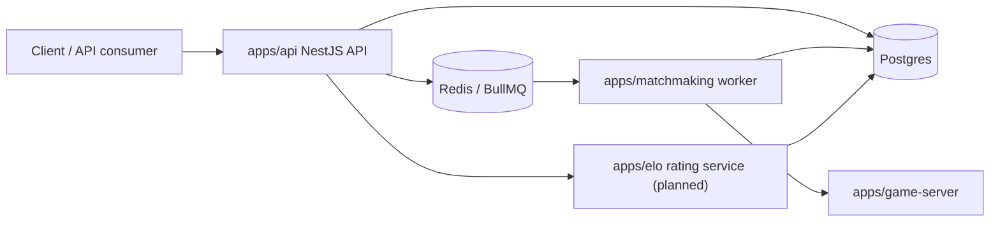
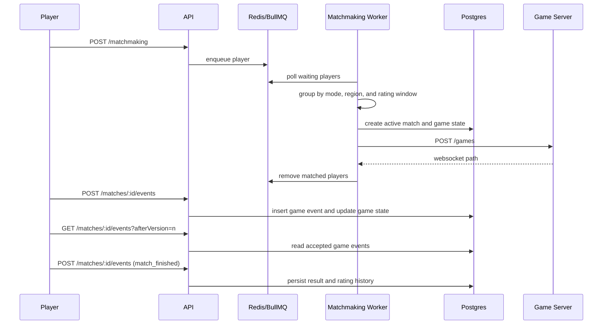

# Architecture

QTime is organized as a service-oriented TypeScript monorepo. The API receives player-facing requests, Redis/BullMQ carries queue events, workers process queued players, and Postgres stores durable user/match data.

## System Context

## Services

### API

Location: `apps/api`

Responsibilities:

- Expose HTTP endpoints.
- Manage users through Prisma.
- Accept matchmaking queue requests.
- Expose authenticated match discovery and state reads.
- Accept client-authoritative game events and expose event polling.
- Publish queue jobs to Redis/BullMQ.
- Provide Bull Board at `/queues` once queue wiring is aligned.

Main modules:

- `UserModule`: user CRUD backed by Prisma.
- `MatchmakingModule`: accepts queue requests and delegates to events.
- `MatchesModule`: lets authenticated players discover their active match, read state, submit events, and poll events.
- `EventsModule`: BullMQ queue configuration and job publishing.
- `PrismaService`: Prisma client configured with the Postgres adapter.

### Matchmaking Worker

Location: `apps/matchmaking`

Responsibilities:

- Poll queued matchmaking jobs.
- Group waiting players by mode and region.
- Sort players by queue time.
- Expand acceptable ELO difference as queue time increases.
- Produce pairs of matched players.

Current behavior:

- Runs every 2 seconds outside test mode.
- Persists matched pairs as active matches.
- Creates participant rows, participant statistics rows, and an initial game state snapshot.
- Calls the game server to initialize a live room for the persisted match.
- Removes matched BullMQ jobs after successful persistence and room initialization.
- Cancels the persisted match and leaves queue jobs waiting if room initialization fails.

### Shared Types

Location: `packages/types`

Responsibilities:

- Define reusable event payloads.
- Share domain concepts such as `Region`.

Important types:

- `QueuedPlayer`
- `MatchmakingPair`
- `MatchFinishedEvent`
- `Region`

### Shared Game Logic

Location: `packages/game`

Responsibilities:

- Define word-duel game state and events.
- Create initial games and tile bags.
- Score words and apply pure game transitions.
- Provide the same rules implementation to the client and game server.

### Client

Location: `apps/client`

Responsibilities:

- Next.js frontend for presenting the project and, later, user-facing workflows.

### Rating Service

Location: `apps/elo`

Current status:

- Placeholder for future service extraction. The API currently applies the baseline ELO update when it accepts a terminal game event.

Target responsibilities:

- Consume match-finished events once ratings move out of the API.
- Calculate rating deltas.
- Persist rating history.
- Support ELO initially, with room for Glicko or TrueSkill-style algorithms later.

### Game Server

Location: `apps/game-server`

Current status:

- Scaffolded with health, game creation, and WebSocket room connection endpoints.
- Keeps active rooms in memory.
- Initialized by the matchmaking worker after a durable match is created.
- Not yet wired to the client.

Target responsibilities:

- Own active multiplayer game state.
- Accept WebSocket commands from match participants.
- Broadcast accepted snapshots/events.
- Persist accepted events and snapshots.
- Trigger idempotent match finish and rating finalization.

## Queue Flow

## Matchmaking Algorithm

The current worker uses a simple expanding-window strategy:

1. Sort players by `queuedAt`, oldest first.
2. For each player, calculate how many 10-second blocks they have waited.
3. Set the acceptable ELO window to `waitBlocks * 50`.
4. Match with another player in the same mode and regional queue when the ELO difference is within that window.
5. Do not include the same player in more than one match.

This gives the project a clear baseline: early queue time favors fairness; longer wait time gradually favors getting a match.

## Known Alignment Work

- Broadcast accepted updates to match participants.
- Extract rating logic into a service or package when it needs its own runtime boundary.
