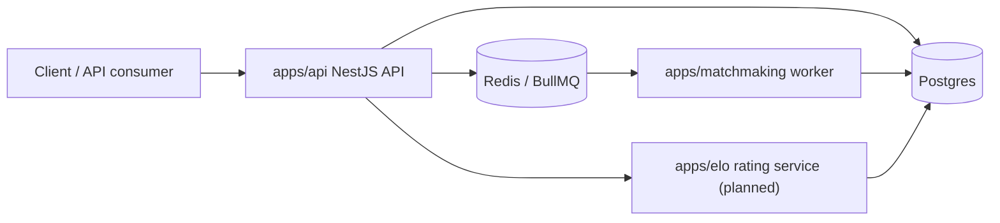
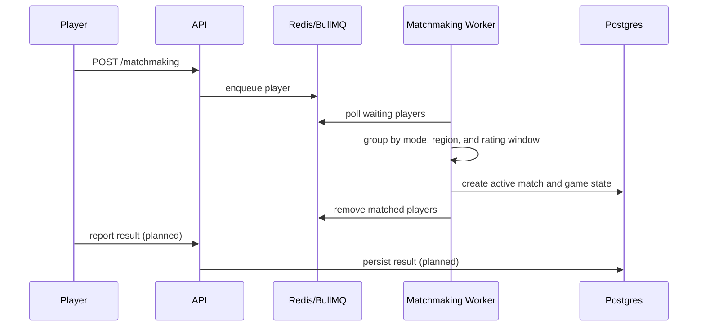

# Architecture

QTime is organized as a service-oriented TypeScript monorepo. The API receives player-facing requests, Redis/BullMQ carries queue events, workers process queued players, and Postgres stores durable user/match data.

## System Context

## Services

### API

Location: `apps/api`

Responsibilities:

- Expose HTTP endpoints.
- Manage users through Prisma.
- Accept matchmaking queue requests.
- Expose authenticated match discovery and state reads.
- Publish queue jobs to Redis/BullMQ.
- Provide Bull Board at `/queues` once queue wiring is aligned.

Main modules:

- `UserModule`: user CRUD backed by Prisma.
- `MatchmakingModule`: accepts queue requests and delegates to events.
- `MatchesModule`: lets authenticated players discover their active match and read match state.
- `EventsModule`: BullMQ queue configuration and job publishing.
- `PrismaService`: Prisma client configured with the Postgres adapter.

### Matchmaking Worker

Location: `apps/matchmaking`

Responsibilities:

- Poll queued matchmaking jobs.
- Group waiting players by mode and region.
- Sort players by queue time.
- Expand acceptable ELO difference as queue time increases.
- Produce pairs of matched players.

Current behavior:

- Runs every 2 seconds outside test mode.
- Persists matched pairs as active matches.
- Creates participant rows, participant statistics rows, and an initial game state snapshot.
- Removes matched BullMQ jobs after successful persistence.

### Shared Types

Location: `packages/types`

Responsibilities:

- Define reusable event payloads.
- Share domain concepts such as `Region`.

Important types:

- `QueuedPlayer`
- `MatchmakingPair`
- `MatchFinishedEvent`
- `Region`

### Client

Location: `apps/client`

Responsibilities:

- Next.js frontend for presenting the project and, later, user-facing workflows.

### Rating Service

Location: `apps/elo`

Current status:

- Placeholder for future rating service work.

Target responsibilities:

- Consume match-finished events.
- Calculate rating deltas.
- Persist rating history.
- Support ELO initially, with room for Glicko or TrueSkill-style algorithms later.

## Queue Flow

## Matchmaking Algorithm

The current worker uses a simple expanding-window strategy:

1. Sort players by `queuedAt`, oldest first.
2. For each player, calculate how many 10-second blocks they have waited.
3. Set the acceptable ELO window to `waitBlocks * 50`.
4. Match with another player in the same mode and regional queue when the ELO difference is within that window.
5. Do not include the same player in more than one match.

This gives the project a clear baseline: early queue time favors fairness; longer wait time gradually favors getting a match.

## Known Alignment Work

- Add match discovery endpoints for authenticated players.
- Add game event submission endpoints.
- Add result reporting and rating update flows.
