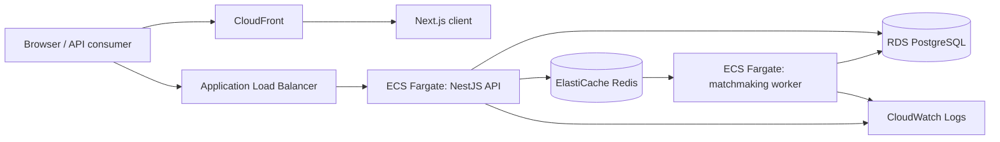

# AWS Deployment Task Plan

This plan describes how the current QTime system maps to AWS and what needs to change before a production-style deployment.

## Target AWS Shape



## Service Mapping

| Current system | Current location | AWS service |
| --- | --- | --- |
| NestJS API | `apps/api` | ECS Fargate service behind an Application Load Balancer |
| Matchmaking worker | `apps/matchmaking` | ECS Fargate service with no public ingress |
| PostgreSQL | `infra/docker-compose.yml` | Amazon RDS for PostgreSQL |
| Redis / BullMQ | `infra/docker-compose.yml` | Amazon ElastiCache for Redis |
| Next.js client | `apps/client` | AWS Amplify Hosting, ECS Fargate, or S3 + CloudFront if static |
| Docker images | `apps/api/Dockerfile`, `apps/matchmaking/Dockerfile` | Amazon ECR repositories |
| Environment variables | `.env`, `.env.docker` | ECS task environment, Secrets Manager, or SSM Parameter Store |
| Logs | Docker logs / local terminal | CloudWatch Logs |
| Prisma migrations | `apps/api/prisma` | One-off ECS task or CI/CD migration step |

## Required Application Changes

### 1. Complete Queue Processing

The API producer, BullMQ registration, Bull Board, and worker consumer now use the shared `MATCHMAKING_QUEUE_NAME` from `packages/types`.

Remaining queue work:

- Persist matches produced by the worker.
- Complete or remove matched queue jobs.
- Prevent duplicate queue entries for the same player.

### 2. Make API Container Production-Ready

Update `apps/api/Dockerfile` so the deployed container does not run the development watcher.

Tasks:

- Build the API during image creation.
- Run `node dist/main` or `npm run start:prod` at container startup.
- Remove `start:dev` from the production container command.
- Avoid running migrations automatically on every API task startup.

### 3. Make Worker Container Production-Ready

The worker currently runs TypeScript through `tsx`. That is fine for development, but production should compile first and run JavaScript.

Tasks:

- Add a `build` script for `apps/matchmaking`.
- Compile the worker into a `dist` directory.
- Update the worker Dockerfile to run built JavaScript with Node.
- Add graceful shutdown handling for ECS task replacement.

### 4. Externalize Secrets and Runtime Config

Move production values out of local `.env` files.

Required runtime values:

- `POSTGRES_USER`
- `POSTGRES_PASSWORD`
- `POSTGRES_DB`
- `POSTGRES_HOST`
- `POSTGRES_PORT`
- `REDIS_HOST`
- `REDIS_PORT`
- `PORT`
- `NODE_ENV`

AWS storage options:

- Secrets Manager for database passwords and other secrets.
- SSM Parameter Store for non-secret configuration.
- ECS task definitions to inject values at runtime.

### 5. Add Health Checks

Add an explicit API health endpoint for the load balancer and deployment checks.

Suggested endpoint:

```text
GET /health
```

Initial behavior can return `200 OK` when the process is alive. Later versions can include checks for Postgres, Redis, and worker queue health.

### 6. Protect Bull Board

Bull Board is currently mounted at `/queues`. In AWS, it should not be publicly exposed without protection.

Options:

- Disable Bull Board in production.
- Gate it behind authentication.
- Expose it only through a private admin route.
- Restrict access using network rules or a VPN.

### 7. Add Client/API Environment Boundaries

When the Next.js client starts calling the API, configure the API base URL per environment.

Suggested value:

```text
NEXT_PUBLIC_API_BASE_URL=https://api.example.com
```

If the client and API are hosted on different domains, enable CORS in the NestJS API and restrict allowed origins to the deployed frontend domain.

## AWS Infrastructure Tasks

### Phase 1: Production-Shape Local Services

- Complete queue job cleanup after the worker finds matches.
- Update API Dockerfile to run production mode.
- Add worker production build and runtime command.
- Add API health endpoint.
- Add local production-like Compose checks.

### Phase 2: Container Registry

- Create ECR repository for the API image.
- Create ECR repository for the matchmaking worker image.
- Optionally create ECR repository for the Next.js client image.
- Add image build and push commands or CI workflow.

### Phase 3: Network and Data Services

- Create a VPC with public and private subnets.
- Place the Application Load Balancer in public subnets.
- Place ECS tasks, RDS, and ElastiCache in private subnets.
- Create RDS PostgreSQL instance.
- Create ElastiCache Redis cluster.
- Configure security groups so only the API and worker can reach RDS/Redis.

### Phase 4: ECS Services

- Create an ECS cluster.
- Create API task definition.
- Create matchmaking worker task definition.
- Create API ECS service with load balancer target group.
- Create worker ECS service without public ingress.
- Configure CloudWatch log groups for both services.

### Phase 5: Database Migrations

- Add a deploy step that runs `prisma migrate deploy` once per release.
- Prefer a one-off ECS task or CI/CD job over running migrations inside every API task.
- Verify RDS connectivity before starting the API rollout.

### Phase 6: Frontend Deployment

- Choose the frontend hosting strategy:
  - Amplify Hosting for the easiest managed Next.js deployment.
  - ECS Fargate if all services should run the same way.
  - S3 + CloudFront only if the app can be exported as static.
- Configure `NEXT_PUBLIC_API_BASE_URL`.
- Add Route 53 and ACM certificates for app and API domains.

### Phase 7: Observability and Operations

- Add structured logging for API and worker.
- Add CloudWatch alarms for API 5xx responses, task restarts, RDS health, Redis health, and queue depth.
- Add metrics for queue size, wait time, match quality, match creation rate, and worker failures.
- Add deployment rollback guidance.

## Deployment Order

1. Make the app production-ready locally.
2. Build and push API and worker images to ECR.
3. Provision VPC, RDS, and ElastiCache.
4. Store runtime config and secrets in AWS.
5. Run Prisma migrations against RDS.
6. Deploy the API ECS service behind the load balancer.
7. Deploy the matchmaking worker ECS service privately.
8. Deploy the Next.js client.
9. Configure DNS and TLS.
10. Add alarms, dashboards, and runbook notes.

## Current Risks Before AWS Deployment

- API Dockerfile runs development mode.
- Migrations are tied to development startup behavior.
- Worker does not yet persist matches or complete/remove matched queue jobs.
- Bull Board would be public unless protected.
- No AWS infrastructure-as-code exists yet.
- Frontend deployment strategy has not been chosen.

## Recommended First Milestone

Before creating AWS infrastructure, complete a production-like local milestone:

- API and worker both run from production Docker images.
- API and worker communicate through the same BullMQ queue.
- API can connect through environment-provided Postgres and Redis hosts.
- Health endpoint returns successfully.
- Prisma migrations can be run as a separate command.

Once this works locally, the AWS deployment becomes mostly infrastructure work rather than application surgery.
