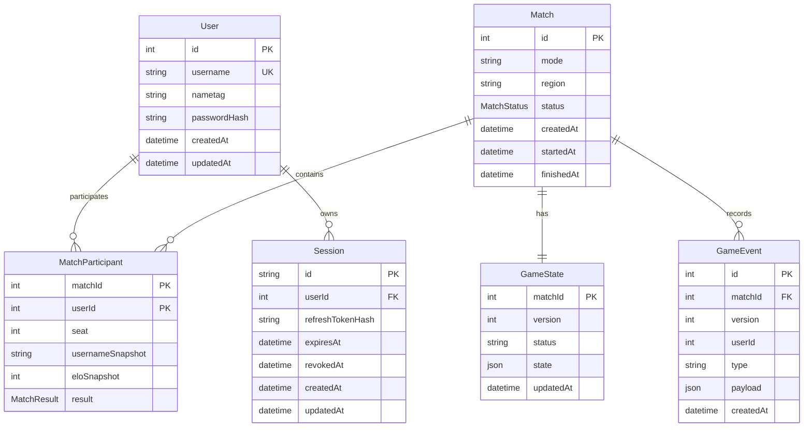

# Data Model

QTime uses Prisma with PostgreSQL. The schema lives at `apps/api/prisma/schema.prisma`.

## Current Models

## User

Represents a registered player.

Fields:

- `id`: auto-incrementing primary key.
- `username`: unique player name.
- `nametag`: optional display tag.
- `passwordHash`: optional Argon2 hash for users created through auth signup.
- `createdAt`: creation timestamp.
- `updatedAt`: update timestamp.

Relationships:

- Has many `MatchParticipant` rows.
- Has many `Session` rows.

## Session

Represents a refresh-token session for auth.

Fields:

- `id`: UUID primary key stored in an HTTP-only cookie.
- `userId`: owning user id.
- `refreshTokenHash`: Argon2 hash of the opaque refresh token.
- `expiresAt`: refresh session expiration.
- `revokedAt`: set when a session is logged out or invalidated.
- `createdAt`: creation timestamp.
- `updatedAt`: update timestamp.

## Match

Represents one created match.

Fields:

- `id`: auto-incrementing primary key.
- `mode`: game mode that produced the match.
- `region`: matchmaking region.
- `status`: lifecycle value, currently `PENDING`, `ACTIVE`, `FINISHED`, or `CANCELLED`.
- `createdAt`: creation timestamp.
- `startedAt`: set when the match becomes active.
- `finishedAt`: set when the match is completed or cancelled.

Relationships:

- Has many `MatchParticipant` rows.
- Has one `GameState` row.
- Has many `GameEvent` rows.

## MatchParticipant

Join model between users and matches.

Fields:

- `matchId`: part of the composite primary key.
- `userId`: part of the composite primary key.
- `seat`: deterministic player position within the match, starting at `0`.
- `usernameSnapshot`: display name captured when the player entered the match.
- `eloSnapshot`: rating value captured when the player entered the match.
- `result`: optional match result for the player.

Relationships:

- Belongs to one `User`.
- Belongs to one `Match`.

## GameState

Stores the latest client-authoritative state snapshot for a match.

Fields:

- `matchId`: primary key and owning match id.
- `version`: optimistic concurrency version for client updates.
- `status`: lightweight game-state status string.
- `state`: JSON snapshot of the latest game state.
- `updatedAt`: update timestamp.

## GameEvent

Stores accepted client game events for audit and replay-friendly history.

Fields:

- `id`: auto-incrementing primary key.
- `matchId`: owning match id.
- `version`: monotonically increasing version within the match.
- `userId`: user that submitted the event.
- `type`: event type.
- `payload`: event payload JSON.
- `createdAt`: creation timestamp.

## Planned Data Additions

The overview calls for several durable concepts that are not modeled yet:

- Player ratings.
- Rating history.
- Match results.
- Queue snapshots or audit records.
- Leaderboard projections.

Suggested next Prisma additions:

- Add `rating`, `ratingDeviation`, or equivalent fields to `User` or a `PlayerRating` model.
- Add `RatingHistory` with old/new rating, delta, algorithm, and match id.
- Add a result or winner field once match outcome semantics are defined.
