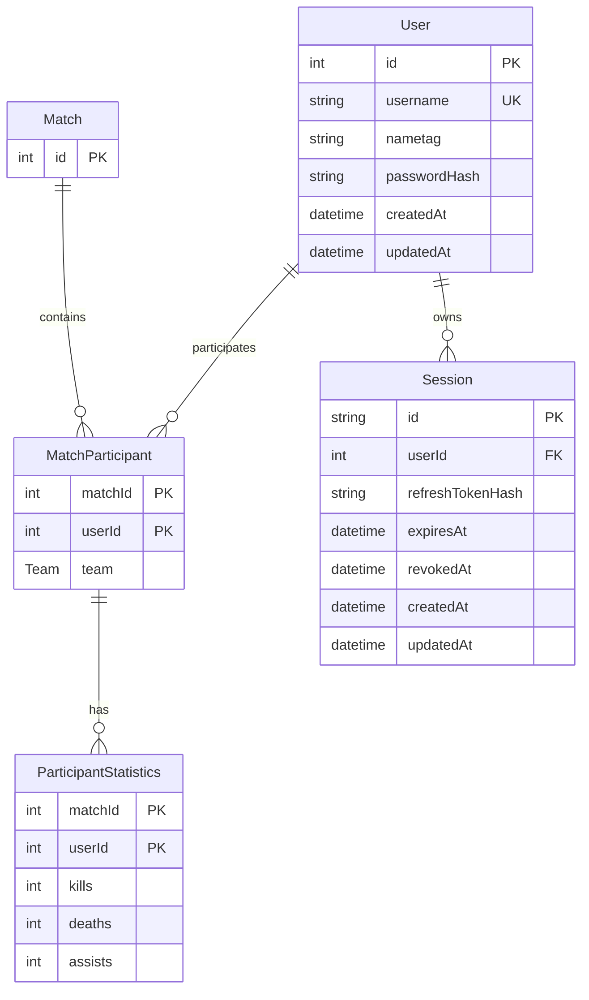

# Data Model

QTime uses Prisma with PostgreSQL. The schema lives at `apps/api/prisma/schema.prisma`.

## Current Models

## User

Represents a registered player.

Fields:

- `id`: auto-incrementing primary key.
- `username`: unique player name.
- `nametag`: optional display tag.
- `passwordHash`: optional Argon2 hash for users created through auth signup.
- `createdAt`: creation timestamp.
- `updatedAt`: update timestamp.

Relationships:

- Has many `MatchParticipant` rows.
- Has many `Session` rows.

## Session

Represents a refresh-token session for auth.

Fields:

- `id`: UUID primary key stored in an HTTP-only cookie.
- `userId`: owning user id.
- `refreshTokenHash`: Argon2 hash of the opaque refresh token.
- `expiresAt`: refresh session expiration.
- `revokedAt`: set when a session is logged out or invalidated.
- `createdAt`: creation timestamp.
- `updatedAt`: update timestamp.

## Match

Represents one created match.

Fields:

- `id`: auto-incrementing primary key.

Relationships:

- Has many `MatchParticipant` rows.

## MatchParticipant

Join model between users and matches.

Fields:

- `matchId`: part of the composite primary key.
- `userId`: part of the composite primary key.
- `team`: enum value, currently `RED` or `BLUE`.

Relationships:

- Belongs to one `User`.
- Belongs to one `Match`.
- Has participant statistics.

## ParticipantStatistics

Stores per-player match stats.

Fields:

- `matchId`: part of the composite primary key.
- `userId`: part of the composite primary key.
- `kills`: defaults to `0`.
- `deaths`: defaults to `0`.
- `assists`: defaults to `0`.

## Planned Data Additions

The overview calls for several durable concepts that are not modeled yet:

- Player ratings.
- Rating history.
- Match status and timestamps.
- Match results.
- Queue snapshots or audit records.
- Region and game mode preferences.
- Leaderboard projections.

Suggested next Prisma additions:

- Add `rating`, `ratingDeviation`, or equivalent fields to `User` or a `PlayerRating` model.
- Add `RatingHistory` with old/new rating, delta, algorithm, and match id.
- Add `Match.status`, `Match.createdAt`, `Match.startedAt`, and `Match.finishedAt`.
- Add a result or winner field once match outcome semantics are defined.
