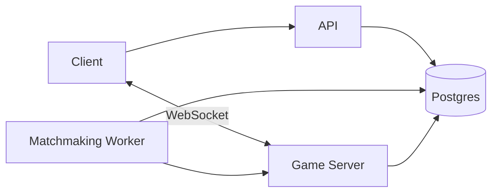

# Game Server Migration Plan

This plan moves active multiplayer game state out of the API and into a dedicated game server while keeping the current persisted match/event model as the durable source of truth.

## Target Architecture

## Service Boundaries

- `apps/api`: authentication, users, matchmaking join/leave, match discovery, game connection tickets, dashboard and history read models.
- `apps/matchmaking`: pairs players, creates durable match rows, asks the game server to initialize a live room, and stores the game server connection metadata.
- `apps/game-server`: owns active game state, accepts WebSocket player commands, validates turn/version, broadcasts accepted updates, and persists events/snapshots.
- `packages/game`: pure word-duel rules, scoring, tile bag, and state transition logic shared by the client and game server.

## Phase 1: Game Server Scaffold

- Add `apps/game-server`.
- Add a health endpoint.
- Add an HTTP game creation endpoint keyed by match id.
- Add a WebSocket endpoint for joining an initialized game room.
- Keep rooms in memory for the first pass.
- Do not wire matchmaking or the client yet.

## Phase 2: Shared Game Package

- Add `packages/game`.
- Move pure game state, scoring, rack, tile bag, and type logic from the client into the shared package.
- Update the client to re-export/use the shared package without changing current runtime behavior.
- Make the game server import the same package for initialization.

## Phase 3: Matchmaking Integration

- Update the matchmaking worker so matched pairs still create durable DB match rows.
- After match creation, call the game server to initialize a room for the match.
- Persist minimal game server metadata on the match or game state record.
- Make game creation idempotent by match id.

Current state:

- The worker initializes a game server room after creating the match and before removing queue jobs.
- Failed room initialization cancels the persisted match and leaves queue jobs waiting for a later poll.
- Game server connection metadata is logged but not yet persisted in a dedicated field.

## Phase 4: Client WebSocket Connection

- Add an API endpoint that issues short-lived game join tickets for authenticated match participants.
- Replace polling in the multiplayer client with a WebSocket connection to the game server.
- Send commands over WebSocket and receive accepted snapshots/events.
- Keep latest-state-on-connect behavior for reconnects.

## Phase 5: Durable Finish and Ratings

- Keep persisted events and snapshots as the durable audit trail.
- Make finish processing idempotent so ratings cannot be applied twice.
- Move rating finalization into a shared package or service boundary once the game server owns terminal match writes.

## Notes

- The game server is client-authoritative for now, matching the current product decision.
- WebSockets should be treated as transport. Accepted events and snapshots remain the data model.
- Join tokens should come from the API; clients should not connect to a game room using only `matchId`.
- Future DX work should extract Prisma into a shared package so the API, matchmaking worker, and game server can share typed persistence without raw SQL.
- Future DX work should evaluate strict runtime validation, likely Zod, for HTTP and WebSocket payloads instead of expanding manual type guards.
